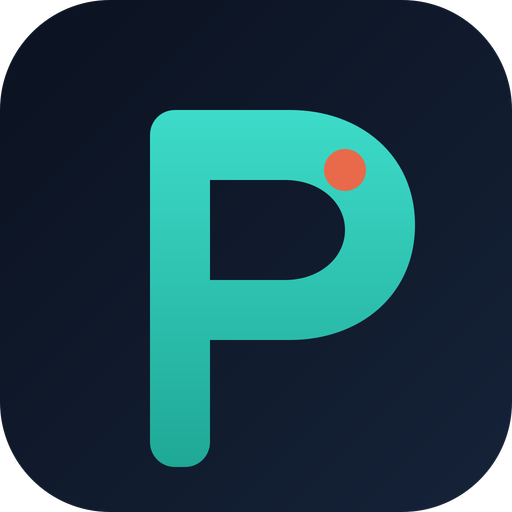

# Phevere

[](https://github.com/thd2020/phevere/releases/latest)
[](LICENSE)
[](#windows)
[](#macos)

<p align="center">
  
</p>

**Select a word anywhere, read it immediately.** Phevere is a desktop dictionary that lives in the system tray: highlight text in the browser, an editor, or a PDF, and a lookup appears with definitions, IPA, translation, etymology, Wikipedia, and a local notebook. Hover OCR covers text that is not selectable. Android and iOS share the same lookup core (sideload).

Publisher: [thd2020](https://github.com/thd2020) · Current desktop: **1.5.0** · Changelog: [`CHANGELOG.md`](CHANGELOG.md)

## In context

Phevere sits with tools people already use for “look this up without leaving the page.” It is not a clone of any of them.

| If you know | Phevere is closer to |
|---|---|
| [PopClip](https://pilotmoon.com/popclip/) (macOS) | A system-wide selection popup, but the payload is a dictionary + notebook rather than an extension marketplace. |
| [Microsoft PowerToys](https://github.com/microsoft/PowerToys) | An always-on Windows utility with a tray icon and OCR ([Text Extractor](https://learn.microsoft.com/en-us/windows/powertoys/text-extractor)). PowerToys is a toolkit; Phevere is lookup-first. |
| [GoldenDict](https://github.com/goldendict/goldendict) / [GoldenDict-ng](https://github.com/xiaoyifang/goldendict-ng) | Online + offline dictionaries (WordNet, Webster 1913, CC-CEDICT). GoldenDict is a library you search; Phevere is an overlay on whatever you already selected. |
| Youdao / Eudic 划词, Apple [Dictionary](https://support.apple.com/guide/dictionary/welcome/mac) | Instant lookup from a selection. Phevere is MIT, has no account, and also does region/hover OCR and Wikipedia in the same pane. |
| Android **Process Text** (Translate, Dictionary) | The same system toolbar slot on Android v1. iOS uses Share / `phevere://lookup`. There is no global overlay on phones. |

Stack: **Electron** (same class as VS Code and Obsidian) plus a small native addon — UI Automation on Windows, Accessibility on macOS — because Chromium alone cannot read another app’s selection.

## Install

Prebuilt desktop binaries: **[GitHub Releases](https://github.com/thd2020/phevere/releases)**. Node.js is not required.

| Platform | Artifact | Notes |
|---|---|---|
| Windows 10/11 **x64** | `Phevere-Setup-<version>-x64.exe` | NSIS wizard; default `C:\Program Files\Phevere` |
| Windows 11 **ARM64** | `Phevere-Setup-<version>-arm64.exe` | Snapdragon / ARM PCs; match the Setup to the OS |
| macOS **Intel** | `Phevere-<version>-darwin-x64.dmg` | Drag to Applications |
| macOS **Apple Silicon** | `Phevere-<version>-darwin-arm64.dmg` | Same |
| Android / iOS | not on Releases | Sideload from a clone — [`docs/MOBILE.md`](docs/MOBILE.md) |

Windows Setup is **unsigned** unless a CA cert is configured (SmartScreen will warn). macOS DMGs are **unsigned** (Gatekeeper). Signing options: [`docs/CODE_SIGNING.md`](docs/CODE_SIGNING.md). Packaging internals: [`PACKAGING.md`](PACKAGING.md).

### Windows

Run the Setup that matches the PC (x64 vs ARM64). Optional components: desktop shortcut, Start menu shortcut, OCR models (~15 MB, on by default).

| | |
|---|---|
| Uninstall | **Settings → Apps → Phevere**, or Start menu → **Uninstall Phevere** |
| Single instance | A second launch focuses the running app (avoids a second tray and SQLite lock) |
| Admin | Recommended for UI Automation into other processes; lookup still works without it, with more fallbacks |

If an old folder remains under Program Files but Apps no longer lists Phevere:

```powershell
# Elevated PowerShell, from a clone of this repo
Set-ExecutionPolicy -Scope Process Bypass
.\scripts\remove-ghost-phevere.ps1
# Optional: also wipe notebook / settings
.\scripts\remove-ghost-phevere.ps1 -AlsoUserData
```

Then install the latest Setup.

### macOS

Open the DMG, drag **Phevere** to Applications. First launch: right-click → **Open**, or allow it under **Privacy & Security**. Grant:

- **Accessibility** — select-to-lookup (TextEdit, Safari, Chromium apps)
- **Screen Recording** — hover, region, and window OCR

The menu-bar **P** has **Open Accessibility Settings…** and **Open Screen Recording Settings…**. Details: [`docs/MACOS_SELECTION.md`](docs/MACOS_SELECTION.md).

### Android / iOS

Not on the store yet. Android: **Phevere** in the system text-selection toolbar (Process Text). iOS: Share sheet or `phevere://lookup?q=…`. Camera OCR and a global overlay are out of scope for v1. See [`docs/MOBILE.md`](docs/MOBILE.md).

## Features

**Capture (desktop).** After a drag or double-click, Windows tries UI Automation (TextPattern), then a Chromium `WM_GETOBJECT` poke, then a silent Ctrl+C with clipboard restore. macOS tries Accessibility (including Chromium text-markers), then Safari/Chrome AppleScript, then silent Cmd+C. Password fields are skipped. A live selection wins over hover OCR. **Back / Forward** (and mouse extra buttons) restore the previous lookup. Capture also works inside Phevere’s own notebook and Settings.

**Dictionary.** Free Dictionary, Wiktionary, and Datamuse. The lexicon is a dictionary in the headword’s language (English stays English senses), not a bilingual matrix. Exact form first; lemma senses only when no source defined that form. Offline packs in Settings → Offline: WordNet, Webster 1913 (GCIDE), CC-CEDICT, FreeDict en→zh (consent download). Living Oxford / Collegiate Webster / Collins are not dumped.

**Pronunciation.** Toolbar speaker plays a **recorded** clip (Free Dictionary MP3 or Wikimedia Commons), cached on disk. Each US / UK IPA chip speaks **that transcription** (Windows System.Speech or macOS `say`), not the spelling.

**Translation.** Settings → Sources: Auto (Google, then MyMemory, then Youdao / DeepL if you add keys). The Translation tab is a language pair (detect, swap, target) among listed languages.

**Wikipedia & etymology.** Tabs in the same popup; Wikipedia opens in an in-panel reader.

**Notebook.** Local SQLite (`%APPDATA%\phevere` on Windows, app support dir on macOS). Search, Recent / A–Z, export/import JSON or CSV. No account.

**OCR.** Bundled PP-OCRv4 (optional Setup component). Settings can fetch PP-OCRv5. Region, hover, clipboard image, and “read this window.” Hover picks the word under the cursor from detection boxes.

**Tray.** Left-click the icon (Windows) or the menu-bar **P** (macOS) for the notebook; right-click for the menu. Settings → Notifications can silence clipboard-image, empty-clipboard, and hover on/off banners. **Quit Phevere** tears down UIA / OCR / sql.js before windows close.

**Chrome.** Light paper UI. Durable windows use the native caption on Windows and traffic lights on macOS.

Languages and source notes: [`docs/MULTILINGUAL.md`](docs/MULTILINGUAL.md). OCR pipeline: [`docs/OCR_CONTEXT_CAPTURE.md`](docs/OCR_CONTEXT_CAPTURE.md).

## Privacy

- The notebook and settings stay on the machine. There is no Phevere account.
- Online lookup and translation call the engines you enable (Free Dictionary, Wiktionary, Google, MyMemory, optional Youdao/DeepL).
- Selection capture skips password fields. Silent copy restores the clipboard.
- Screen Recording on macOS is used only for OCR / window capture, not a remote feed.

## Development

### Prerequisites

- Node.js 18+ (CI uses 22)
- **Windows:** Visual Studio 2022 with the C++ workload (UI Automation addon)
- **macOS:** Xcode Command Line Tools (Accessibility addon, `hdiutil` for DMGs)
- **Mobile:** JDK 21 + Android Studio, or Xcode — [`docs/MOBILE.md`](docs/MOBILE.md)

### Run from source

```bash
git clone https://github.com/thd2020/phevere.git
cd phevere
npm install
npm start
```

Full selection monitoring on a Mac/Linux-style shell: `npm run start-admin`. Phone web UI: `npm run mobile:dev`.

`make:win` and `npm install` use npmmirror Electron mirrors by default (avoids `github.com` timeouts on some networks). If Electron’s postinstall still hangs: `ELECTRON_SKIP_BINARY_DOWNLOAD=1 npm install`. `npm start` re-extracts the runtime if a cancelled install left `path.txt` missing.

In the `npm start` terminal, **Ctrl+C** once stops Electron and Forge. Tray **Quit Phevere** exits Electron (and that terminal). Packaged builds have no webpack process.

### Package locally

```bash
npm run build-native
npm run make:win          # out/make/nsis/x64/Phevere-Setup-*-x64.exe
npm run make:win:arm64    # ARM64 host or VS ARM64 tools
npm run make:mac:x64      # Intel DMG (macOS)
npm run make:mac:arm64    # Apple Silicon DMG (macOS)
```

### CI / CD

Every PR and push to `main` packages unpackaged Windows and macOS apps and runs `verify-ocr-pack`. Push an annotated tag `v*.*.*` (or **Actions → release → Run workflow**) to build both Windows Setups and both macOS DMGs, attach them to the GitHub Release, and attest each file. See [`docs/RELEASE.md`](docs/RELEASE.md).

## Architecture

```
Desktop:  selection / OCR / shortcut  →  Electron main  →  popup renderer
Mobile:   Process Text / Share / search  →  Capacitor WebView
                              ↓
                     packages/core (dictionary + vocab SQLite)
```

| Piece | Location |
|---|---|
| Shared lookup + notebook types | [`packages/core`](packages/core) |
| Windows UIA / macOS AX addon | [`native-addon/`](native-addon) |
| Desktop shell | Electron Forge + webpack (`src/`) |
| Windows installer | electron-builder NSIS (`electron-builder.yml`, `packaging/installer.nsh`) |
| Mobile | Capacitor in [`apps/mobile`](apps/mobile) |

## License

[MIT](LICENSE) © thd2020
