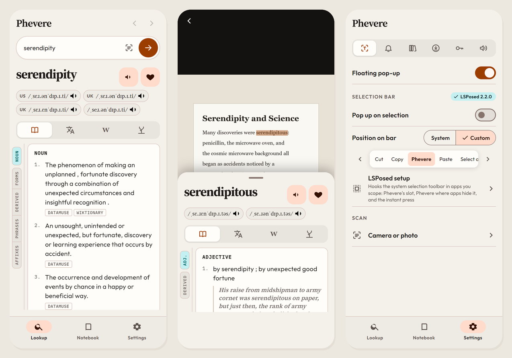

# Phevere

[](https://github.com/thd2020/phevere/releases/latest)
[](https://github.com/thd2020/phevere/actions/workflows/ci.yml)
[](LICENSE)

Phevere is a dictionary for text you are already reading. Select a word in any application and a lookup opens beside it, with definitions, pronunciation, translation, etymology, and Wikipedia, and a local notebook for the words you keep. It runs on Windows and macOS as a tray application, and on Android and iOS as a phone app built on the same dictionary core.

<p align="center">
  
</p>
<p align="center"><sub>Android app: a lookup, a word selected on a scanned page, and the selection-bar settings.</sub></p>

The current desktop release is **2.0.0**. Changes are listed in [`CHANGELOG.md`](CHANGELOG.md).

## Features

**Lookup**

- Definitions from Free Dictionary, Wiktionary, and Datamuse, merged into a single lexicon in the headword's language. The exact form is preferred, and lemma senses are used only when no source defines that form.
- IPA by accent (US and UK), each chip spoken from its own transcription by eSpeak NG. Words no online source transcribes get US IPA from the CMU Pronouncing Dictionary. Recorded pronunciations come from Free Dictionary and Wikimedia Commons and are cached on disk; when a word has none, the chosen voice says it. Neural Kokoro voices (132 MB or 350 MB) can be downloaded in Settings → Audio on the desktop and on Android.
- Translation through Google Translate and MyMemory without a key, or through Youdao or DeepL with your own keys.
- Etymology from Wiktionary, Etymonline, and Youdao, and a Wikipedia reader in the same pane.
- Offline packs: WordNet, Webster 1913 (GCIDE), CC-CEDICT, and FreeDict English–Chinese.
- A notebook stored locally in SQLite, with search, sorting, and JSON or CSV import and export. There is no account.

**Desktop (Windows, macOS)**

- Select-to-lookup in other applications. On Windows, Phevere reads the selection through UI Automation, then a Chromium accessibility request, then a silent copy that restores the clipboard. On macOS it uses the Accessibility API, then AppleScript for Safari and Chrome, then a silent copy. Password fields are skipped.
- OCR for text that cannot be selected: hover, region, clipboard image, and whole window, using bundled PP-OCRv4 models (PP-OCRv5 is available as a download).
- Back and forward through recent lookups, including the mouse's extra buttons.
- A slim toolbar opens beside the selection. Its first four icons open the Lexicon, Translation, Wikipedia, and Etymology views, and the open view shows as a tab joined to the page.

**Android**

- **Phevere** on the system text-selection bar opens a compact lookup beside the selected word. The lookup is a floating window over the current app when *Display over other apps* is granted, and a bottom sheet otherwise.
- *Pop up on selection* opens the lookup as soon as text is selected, without a tap. Without root this uses an accessibility service; on rooted devices it uses the LSPosed module described below.
- Scan: take or choose a photo and select words directly on the picture. Recognition runs on the device with ML Kit, for Latin and Chinese script.
- Pronunciation works offline with a bundled eSpeak NG voice. Two optional neural voices (Kokoro, 132 MB and 350 MB) can be downloaded in Settings.

**iOS**

- Share text to Phevere, or open `phevere://lookup?q=word`, to show the lookup as a floating card or a sheet.
- Selected text inside the app has a **Phevere** item in the edit menu. Scan uses Apple Vision, and pronunciation uses the voices installed on the device.

## Installation

### Windows and macOS

Download the installer for your platform from [GitHub Releases](https://github.com/thd2020/phevere/releases/latest). Node.js is not required.

| Platform | File |
|---|---|
| Windows 10 and 11, x64 | `Phevere-Setup-<version>-x64.exe` |
| Windows 11, ARM64 | `Phevere-Setup-<version>-arm64.exe` |
| macOS 11 or later, Intel | `Phevere-<version>-darwin-x64.dmg` |
| macOS 11 or later, Apple silicon | `Phevere-<version>-darwin-arm64.dmg` |

Release builds are not code-signed, so Windows SmartScreen and macOS Gatekeeper will ask for confirmation on first launch. [`docs/CODE_SIGNING.md`](docs/CODE_SIGNING.md) describes how to sign your own builds.

**Windows.** The installer places Phevere in `C:\Program Files\Phevere` and optionally installs the OCR models (about 15 MB). Running Phevere as administrator lets UI Automation read selections in elevated applications. To uninstall, use **Settings → Apps → Phevere**. If an earlier installation left files behind that the Apps list no longer shows, run `scripts\remove-ghost-phevere.ps1` from an elevated PowerShell prompt.

**macOS.** Drag Phevere to Applications and open it with right-click → **Open** the first time. Grant **Accessibility** for select-to-lookup and **Screen Recording** for OCR; the menu-bar icon links to both settings. See [`docs/MACOS_SELECTION.md`](docs/MACOS_SELECTION.md).

### Android

Android 7.0 (API 24) or later. The phone apps are not yet published to an app store. Each CI run on `main` builds a debug APK, which you can download from the run's **Artifacts** section as `phevere-android`. The version shown by the installer has the form `0.2.0-dev.<build>+<commit>`.

The LSPosed module is optional and requires a rooted device. Enabled in LSPosed for the apps you choose, it hooks the system text-selection toolbar so that Phevere appears at a position you set, is added back in apps that hide third-party actions (X, for example), and can be pressed automatically on selection. Setup steps are in [`apps/mobile/ANDROID.md`](apps/mobile/ANDROID.md).

### iOS

iOS 14 or later. CI produces an unsigned IPA (`phevere-ios`), which must be signed before it can be installed on a device.

## Privacy

- The notebook and settings are stored on the device. Phevere has no account or server of its own.
- Lookups and translations are sent only to the services enabled in Settings.
- Selection capture skips password fields, and a silent copy restores the previous clipboard contents.
- On macOS, Screen Recording permission is used only for OCR.
- On Android, the LSPosed module adds only the Phevere item to a selection bar. When an app gives no other way to read the selection, the module copies the selected text and then restores the clipboard.

## Building from source

### Prerequisites

- Node.js 18 or later (CI uses Node.js 22)
- Windows: Visual Studio 2022 with the *Desktop development with C++* workload, for the UI Automation addon
- macOS: Xcode Command Line Tools
- Android: JDK 17 or later and the Android SDK (API 36, NDK 28.2, CMake 3.22.1); Python 3 for the speech bundle
- iOS: Xcode on macOS

### Desktop

```bash
git clone https://github.com/thd2020/phevere.git
cd phevere
npm install
npm start
```

To build installers:

```bash
npm run build-native
npm run make:win          # Windows x64 installer
npm run make:win:arm64    # Windows ARM64 installer
npm run make:mac:x64      # macOS Intel DMG
npm run make:mac:arm64    # macOS Apple silicon DMG
```

Output is written to `out/make`. [`PACKAGING.md`](PACKAGING.md) covers the installer configuration. If the Electron download stalls during `npm install`, set `ELECTRON_SKIP_BINARY_DOWNLOAD=1`; the install and start scripts then fetch the runtime with `scripts/ensure-electron.js`.

### Mobile

```bash
npm run mobile:dev        # phone UI in a desktop browser, with development proxies
npm run mobile:build      # build the web bundle and copy it into the Android and iOS projects
```

For the Android APK, prepare the speech bundle and run Gradle:

```bash
python apps/mobile/scripts/prepare-speech.py
cd apps/mobile/android
./gradlew assembleDebug
```

For iOS, open `apps/mobile/ios/App/App.xcodeproj` in Xcode. Further detail is in [`docs/MOBILE.md`](docs/MOBILE.md) and [`apps/mobile/ANDROID.md`](apps/mobile/ANDROID.md).

### Continuous integration and releases

Every pull request and every push to `main` builds the desktop applications for Windows and macOS, the Android APK, and the iOS IPA, and runs the mobile regression tests. Pushing a tag of the form `v*.*.*` builds the Windows installers and macOS disk images, attaches them to a GitHub Release, and publishes build provenance attestations. See [`docs/RELEASE.md`](docs/RELEASE.md).

## Project structure

| Path | Contents |
|---|---|
| [`packages/core`](packages/core) | Dictionary sources, merging, translation, pronunciation, and notebook storage, shared by all platforms |
| [`src`](src) | Desktop application (Electron main process and renderer) |
| [`native-addon`](native-addon) | Selection capture: UI Automation on Windows, Accessibility on macOS |
| [`apps/mobile`](apps/mobile) | Phone user interface, and the native Android and iOS projects that host it |
| [`packaging`](packaging) | Installer configuration and icons |
| [`docs`](docs) | Platform notes, release process, and design documents |

## Documentation

- [`docs/MOBILE.md`](docs/MOBILE.md): phone apps, architecture, and limitations
- [`apps/mobile/ANDROID.md`](apps/mobile/ANDROID.md): Android build, speech, versioning, and the LSPosed module
- [`docs/MACOS_SELECTION.md`](docs/MACOS_SELECTION.md): macOS permissions and selection capture
- [`docs/MULTILINGUAL.md`](docs/MULTILINGUAL.md): supported languages and sources
- [`docs/OCR_CONTEXT_CAPTURE.md`](docs/OCR_CONTEXT_CAPTURE.md): the OCR pipeline

## License

Phevere is released under the [MIT License](LICENSE). The Android application bundles eSpeak NG, which is licensed under GPL-3.0-or-later; see [`apps/mobile/ANDROID.md`](apps/mobile/ANDROID.md) for the licence terms of the distributed APK.
